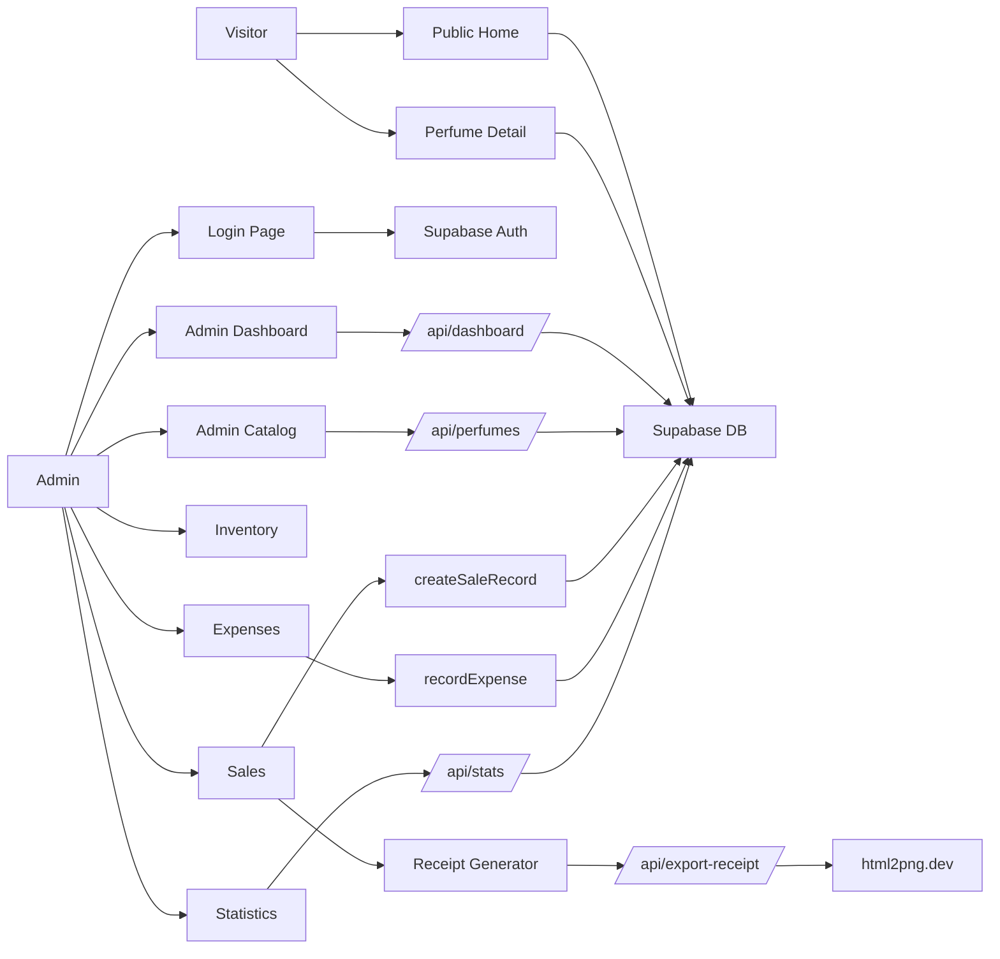

# Process Flow

## Scope
This document describes how the Decants ni Bro app moves data through the public catalog and admin dashboard, based on the current repository implementation.

## Architecture Summary
- Next.js App Router with Server Components and Client Components
- Server Actions for admin mutations (sales, expenses)
- API Routes for dashboard data and CRUD
- Supabase for Auth, Postgres, and Storage
- External html2png service for receipt image export

## Actors
- Public visitor
- Admin user
- Supabase services (Auth, Database, Storage)
- html2png service (receipt export)

## Route Map
Public pages
- / (home + public catalog)
- /perfume/[id] (perfume detail)

Admin pages
- /login (admin sign-in)
- /admin (redirects to /admin/dashboard)
- /admin/dashboard
- /admin/catalog
- /admin/perfume/new
- /admin/perfume/[id]/edit
- /admin/inventory
- /admin/sales
- /admin/expenses
- /admin/stats

API routes
- /api/dashboard
- /api/perfumes
- /api/perfumes/[id]
- /api/inventory
- /api/sales
- /api/reviews
- /api/stats
- /api/export-receipt

Server actions
- /admin/sales/actions (createSaleRecord)
- /admin/expenses/actions (recordExpense)

## High-Level Flow

## Process Flows

### Public Catalog (/) and Landing Sections
1. Request hits / (server component).
2. Server creates Supabase client and fetches all rows from perfumes.
3. If perfumes is empty, fallback seed data is used.
4. Data is mapped into the catalog card format and rendered in the landing sections.
5. User can click into a perfume detail page.

Data touched
- perfumes (read)

### Perfume Detail (/perfume/[id])
1. Request hits /perfume/[id] (server component).
2. Server queries Supabase for a single perfume by id (from perfume_catalog).
3. If not found, a local fallback object is used.
4. The page renders details, pricing, and a local-only review list.

Data touched
- perfume_catalog (read)

### Reviews (UI)
1. ReviewSection accepts an initial review list (currently hard-coded on the detail page).
2. Submitting a review updates local state only (no API call).

Data touched
- none (local UI only)

### Admin Authentication (/login)
1. Admin enters email and password on the login page.
2. Client calls supabase.auth.signInWithPassword.
3. On success, client redirects to /admin and then /admin/dashboard.
4. API routes perform their own auth checks; there is no global middleware gate.

Data touched
- Supabase Auth session

### Admin Dashboard (/admin/dashboard)
1. Client page loads and fetches /api/dashboard.
2. API computes metrics:
   - total perfumes count
   - low stock or in transit count (status filter)
   - current month revenue and profit from sales
   - last 7 days revenue trend
3. Client renders metrics, recent sales, and chart.

Data touched
- perfumes (read)
- sales (read)

### Admin Catalog (CRUD)
1. /admin/catalog fetches /api/perfumes for list data.
2. Add flow: /admin/perfume/new -> PerfumeForm -> POST /api/perfumes.
3. Edit flow: /admin/perfume/[id]/edit -> PerfumeForm -> PUT /api/perfumes/[id].
4. Delete flow: /admin/catalog -> DELETE /api/perfumes/[id].

Photo upload
1. PhotoUpload uploads images to Supabase Storage bucket perfume-images.
2. The public URL is saved in image_url on the perfume record.

Data touched
- perfumes (read/write)
- storage.objects (upload)

### Inventory Management (/admin/inventory)
1. Client loads perfumes and inventory_log directly from Supabase (no API route).
2. Admin updates a perfume status using the dropdown.
3. Client updates perfumes.status and writes an inventory_log entry (type adjustment).
4. Client refreshes inventory data.

Data touched
- perfumes (read/write)
- inventory_log (read/write)

### Sales Recording (/admin/sales)
1. Server component loads in-stock perfumes and recent sales for the UI.
2. Client submits RecordSaleForm.
3. Server action createSaleRecord inserts into sales.
4. Revalidates /admin/sales and /admin/dashboard.

Data touched
- perfumes (read)
- sales (write)

### Receipt Export (from Sales)
1. Admin opens Receipt Generator modal and builds a receipt list.
2. Client generates an HTML snapshot of the receipt.
3. Client POSTs to /api/export-receipt.
4. API forwards to html2png.dev and returns a PNG stream.
5. Client downloads the PNG file.

Data touched
- none (export only)

### Expenses (/admin/expenses)
1. Server component fetches recent expenses for display.
2. RecordExpenseForm submits to server action recordExpense.
3. Server action inserts expense and revalidates /admin/expenses and /admin/dashboard.

Data touched
- expenses (read/write)

### Statistics (/admin/stats)
1. Client selects a month (YYYY-MM) and fetches /api/stats.
2. API aggregates sales and expenses for the month.
3. Client renders summary cards, charts, and expense accordion.

Data touched
- sales (read)
- expenses (read)

## Data Model (Supabase)
Tables
- perfumes: catalog items, pricing, status, notes, image URL
- sales: transactions (perfume_id, size, qty, revenue, profit, sale_date)
- inventory_log: status or stock adjustments
- reviews: perfume reviews
- expenses: monthly expenses

Relationships
- sales.perfume_id -> perfumes.id
- inventory_log.perfume_id -> perfumes.id
- reviews.perfume_id -> perfumes.id

Security (RLS)
- perfumes: public read, authenticated write
- reviews: public read, authenticated write
- sales, inventory_log, expenses: authenticated only
- storage.perfume-images: public read, authenticated write

## Current Implementation Notes
- Status values are used as: in stock, out of stock, new, in transit in admin pages and dashboard API.
- types.ts and the public home page still reference older status values (active, out_of_stock, discontinued).
- /perfume/[id] fetches from perfume_catalog (not defined in migrations).
- Reviews UI is client-only and does not write to /api/reviews.
- createSaleRecord does not decrement stock or write inventory_log entries.
